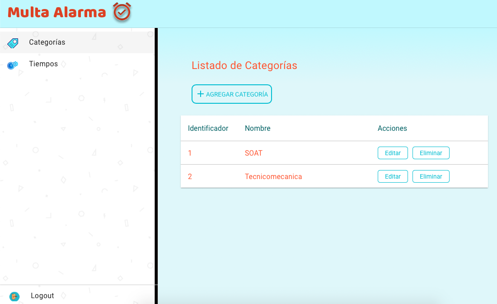
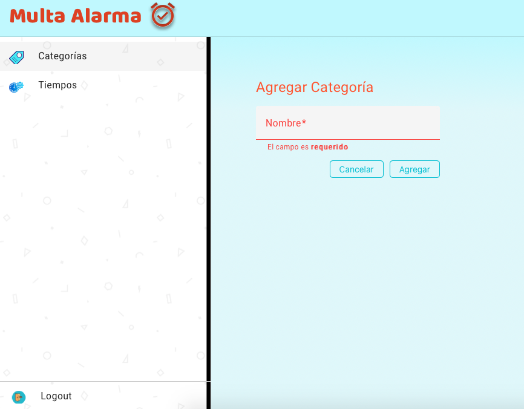
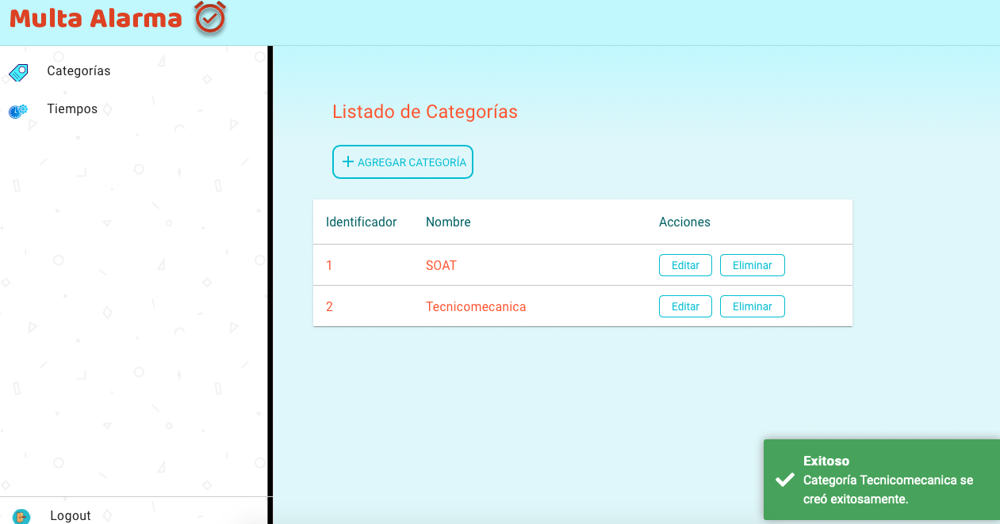
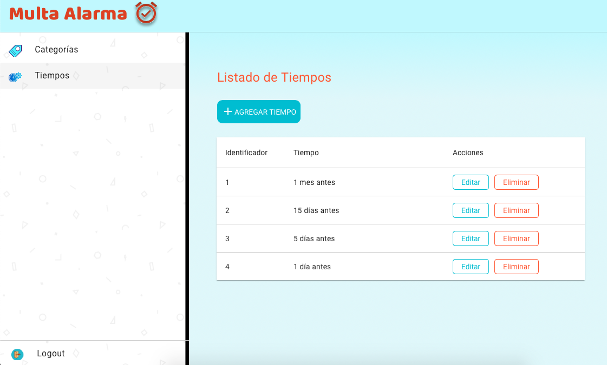
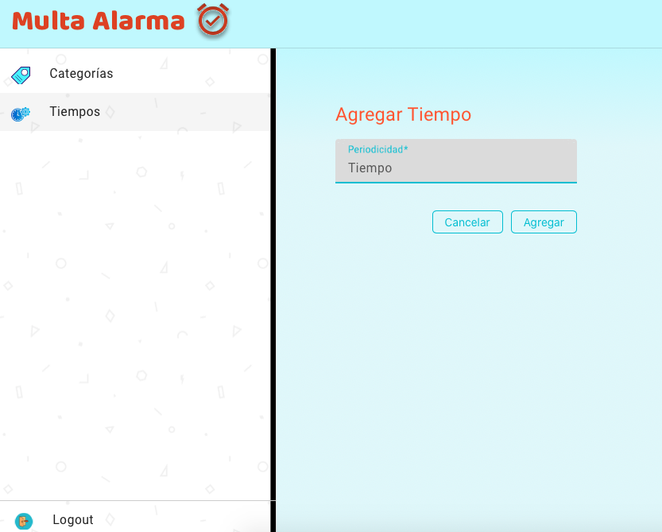

# AlarmaApp

## Prerrequisitos:

Angular CLI: 15.2.9
Node: 18.18.0
Package Manager: npm 9.8.1

# Iniciación a Angular. Ejemplos.

Para probar los ejemplos de este repositorio, teclea los siguientes comandos:

1. Clona este repositorio en local:

```console
git clone https://github.com/Miltonbel/multa-alarma-v1.git
```

2. Entra en el directorio del proyecto:

```console
cd multa-alarma-v1
```

3. Instala las dependencias:

```console
npm install
```

4. Lanza el servidor para ver la aplicación en http://localhost:4200/:

```console
ng serve
```

La página principal en la que se cargan todos los ejemplos es `app.component.html`:

```html









```

